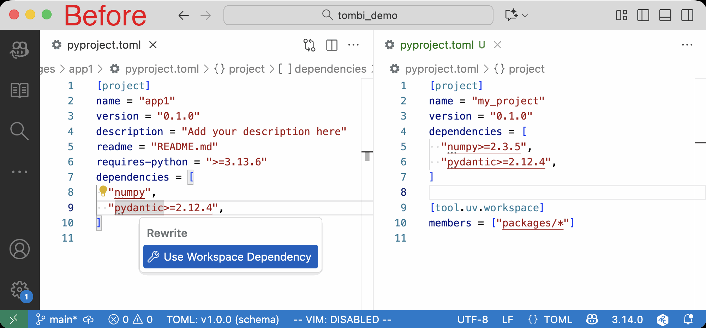
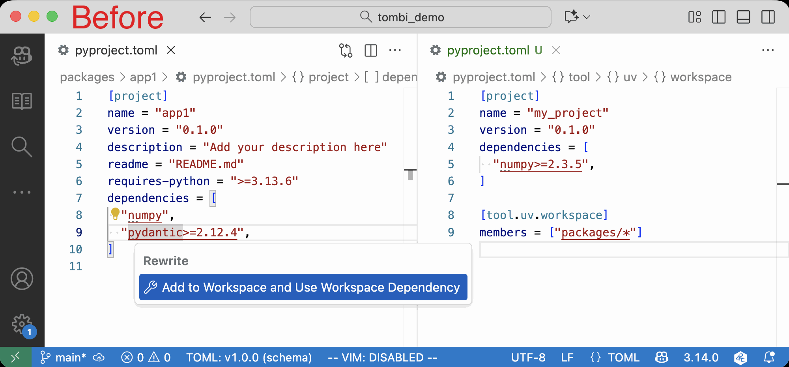
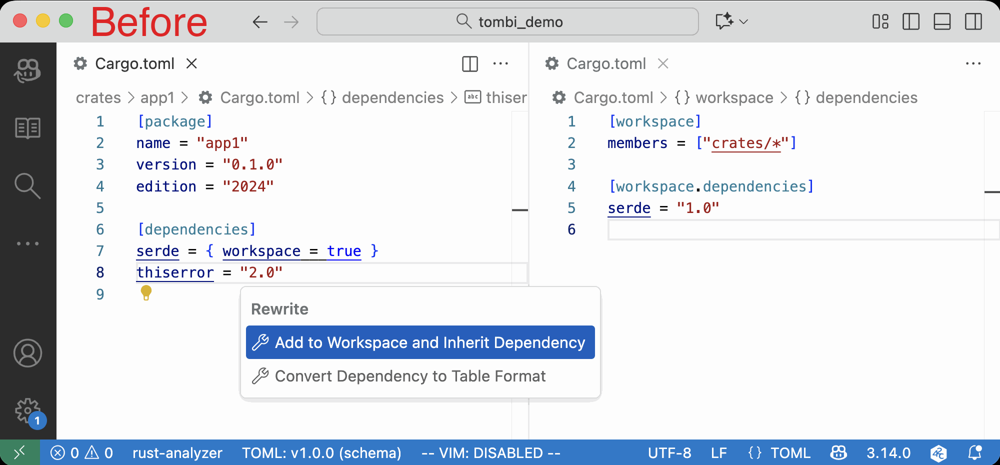

# Rust/Python のモノレポでワークスペース開発を快適に

Rust の Cargo と Python の uv はモノレポ開発を便利にするワークスペース機能に対応しています。

Tombi はワークスペースを用いた開発をサポートする便利な定義移動とコードアクション機能を提供しています。本記事では、Cargo と uv のワークスペース機能を解説し、Tombi がどのようにワークスペース開発をサポートしているかを紹介します。

## ワークスペース機能とは？

ワークスペース（Workspace）とは、複数の関連するパッケージやクレートを一つのリポジトリ内で管理するための仕組みです。モノレポ（Monorepo）とも呼ばれるこのアプローチには、以下のような利点があります：

- **依存関係の一元管理**: すべてのパッケージで同じバージョンの依存関係を使用できる
- **ビルドの効率化**: 共通の出力ディレクトリを使用し、ビルド成果物を共有
- **コードの再利用性向上**: 関連するパッケージ間でコードを簡単に共有
- **プロジェクトの構造が明確**: 関連するコンポーネントをまとめて管理

## Rust におけるワークスペース機能

### Cargo ワークスペースの基本

Cargo のワークスペースは、複数のクレートを一つのプロジェクトとして管理する機能です。共通の `Cargo.lock` ファイルと出力ディレクトリを共有することで、依存関係の一貫性を保ちながら、各クレートを個別にビルド・テストできます。

### ワークスペースの設定例

ルートディレクトリの `Cargo.toml` でワークスペースを定義します：

```toml
[workspace]
resolver = "2"
members = [
  "crates/*",
  "extensions/*",
]

[workspace.package]
version = "0.1.0"
authors = ["Your Name <you@example.com>"]
edition = "2021"

[workspace.dependencies]
serde = { version = "1.0", features = ["derive"] }
tokio = { version = "1.0", features = ["full"] }
```

### ワークスペース依存関係の継承

Cargo では `workspace.dependencies` に定義した依存関係を、メンバークレートから継承できます：

```toml
# メンバークレートの Cargo.toml
[dependencies]
serde = { workspace = true }
tokio = { workspace = true }
```

このアプローチにより、すべてのメンバークレートで同じバージョンの依存関係を使用でき、バージョン管理が容易になります。

### Tombi プロジェクトの例

Tombi 自体も Cargo ワークスペースを使用しています。30以上のクレートを一元管理し、LSP サーバー、フォーマッター、リンターなどの機能を分離しています：

```toml
[workspace]
members = [
  "crates/*",           # tombi-ast, tombi-lsp など30以上のクレート
  "editors/zed",        # Zed エディタ拡張
  "extensions/*",       # tombi-extension-cargo, tombi-extension-uv など
  "rust/*",             # CLI、WASM バインディングなど
]
```

## Python におけるワークスペース機能

### uv ワークスペースの基本

uv は Rust で書かれた高速な Python パッケージマネージャーで、2024年にワークスペース機能のサポートを追加しました。複数の Python パッケージを一つのリポジトリで管理し、依存関係を効率的に解決します。

### ワークスペースの設定例

ルートディレクトリの `pyproject.toml` でワークスペースを定義します：

```toml
[project]
name = "my-workspace"
version = "0.1.0"
dependencies = [
  "pydantic>=2.10",
  "anyio>=4.0",
]

[tool.uv.workspace]
members = [
  "packages/app",
  "packages/lib",
]
```

### ワークスペース依存関係の参照

メンバーパッケージでは、バージョン指定を省略することで、ワークスペースで定義された依存関係を使用できます：

```toml
# メンバーパッケージの pyproject.toml
[project]
name = "app"
version = "0.1.0"
dependencies = [
  "pydantic",  # ワークスペースで定義されたバージョンを使用
  "anyio",
]
```

### ワークスペースメンバー間の依存

ワークスペース内のメンバー同士を依存関係として参照することもできます：

```toml
[tool.uv.sources]
my-lib = { workspace = true }

[project]
dependencies = [
  "my-lib",  # 同じワークスペース内のパッケージを参照
]
```

## Tombi によるワークスペース開発のサポート

Tombi は、Cargo と uv のワークスペース開発を支援する強力な機能を提供しています。

### 1. 定義へ移動（Goto Definition/Declaration）

ワークスペース依存関係の宣言から、実際の定義箇所へジャンプできます。

#### Cargo での例

```toml
[dependencies]
serde = { workspace = true }  # ここから Cmd/Ctrl + Click
```

↓ ワークスペースルートの `Cargo.toml` にジャンプ

```toml
[workspace.dependencies]
serde = { version = "1.0", features = ["derive"] }  # ここへ移動
```

#### uv での例

```toml
[project]
dependencies = [
  "pydantic",  # ここから Cmd/Ctrl + Click
]
```

↓ ワークスペースルートの `pyproject.toml` にジャンプ

```toml
[project]
dependencies = [
  "pydantic>=2.10",  # ここへ移動
]
```

#### 実装の仕組み

Tombi の `tombi-extension-uv` と `tombi-extension-cargo` は、以下の手順で定義箇所を見つけます：

1. カーソル位置の依存関係名を解析（PEP 508 パーサーなどを使用）
2. 現在のファイルからワークスペースルートを探索
3. ワークスペースの設定ファイルをパースして依存関係定義を検索
4. 該当する定義の位置情報（URI + Range）を LSP クライアントに返す

### 2. コードアクション：ワークスペース依存関係への変換

Tombi の最も便利な機能の一つが、依存関係をワークスペース形式に自動変換するコードアクションです。

#### uv: "Use Workspace Dependency"

メンバーパッケージでバージョン付き依存関係が定義されており、ワークスペースにも同じパッケージが定義されている場合、ワークスペース参照に変換できます。

**実行前:**

```toml
# ワークスペースルート
[project]
dependencies = ["pydantic>=2.10,<3.0"]

# メンバーパッケージ
[project]
dependencies = ["pydantic>=2.10,<3.0"]  # 💡 コードアクション利用可能
```

**"Use Workspace Dependency" を実行:**

```toml
# メンバーパッケージ
[project]
dependencies = ["pydantic"]  # バージョン指定が削除され、ワークスペース参照になる
```



#### uv: "Add to Workspace and Use Workspace Dependency"

依存関係がワークスペースに存在しない場合、ワークスペースに追加し、メンバーパッケージはそれを参照するように変換できます。

**実行前:**

```toml
# ワークスペースルート
[project]
dependencies = []

# メンバーパッケージ
[project]
dependencies = ["requests>=2.31.0"]  # 💡 コードアクション利用可能
```

**"Add to Workspace and Use Workspace Dependency" を実行後:**

```toml
# ワークスペースルート（自動的に追加される）
[project]
dependencies = [
  "requests>=2.31.0",
]

# メンバーパッケージ（バージョン指定が削除される）
[project]
dependencies = ["requests"]
```



#### Cargo: "Use Workspace Dependency"

Cargo でも同様に、ワークスペース依存関係への変換がサポートされています。

**実行前:**

```toml
# ワークスペースルート
[workspace.dependencies]
serde = { version = "1.0", features = ["derive"] }

# メンバークレート
[dependencies]
serde = { version = "1.0", features = ["derive"] }  # 💡 コードアクション利用可能
```

**"Use Workspace Dependency" を実行後:**

```toml
# メンバークレート
[dependencies]
serde = { workspace = true }
```


#### Cargo: "Add to Workspace and Inherit Dependency"

ワークスペースに依存関係を追加し、メンバークレートでは `workspace = true` を使用するように変換します。

**実行前:**

```toml
# ワークスペースルート
[workspace.dependencies]

# メンバークレート
[dependencies]
tokio = { version = "1.0", features = ["full"] }  # 💡 コードアクション利用可能
```

**"Add to Workspace and Inherit Dependency" を実行後:**

```toml
# ワークスペースルート（自動的に追加される）
[workspace.dependencies]
tokio = { version = "1.0", features = ["full"] }

# メンバークレート
[dependencies]
tokio = { workspace = true }
```



### 実装の詳細

これらのコードアクションは、複数のファイルを同時に編集する `WorkspaceEdit` を使用して実装されています：

```rust
// 擬似コード
let workspace_edit = WorkspaceEdit {
    document_changes: vec![
        // ワークスペースルートの変更
        TextDocumentEdit {
            uri: workspace_uri,
            edits: vec![/* 依存関係を追加 */],
        },
        // メンバーファイルの変更
        TextDocumentEdit {
            uri: member_uri,
            edits: vec![/* バージョン指定を削除 */],
        },
    ],
};
```

この仕組みにより、一度のコードアクション実行で、ワークスペースルートとメンバーファイルの両方を適切に更新できます。

## Tombi の技術的特徴

### 拡張システム

Tombi は拡張システムを採用しており、Cargo や uv 固有の機能は独立した拡張として実装されています：

- `tombi-extension-cargo`: Cargo ワークスペースのサポート
- `tombi-extension-uv`: uv ワークスペースのサポート
- `tombi-extension-tombi`: Tombi 自体の設定ファイルサポート

この設計により、新しいツールやフォーマットのサポートを容易に追加できます。

### LSP によるエディタ統合

Tombi は Language Server Protocol (LSP) を実装しているため、VS Code、Zed、IntelliJ など、LSP をサポートする任意のエディタで使用できます。

### スキーマ駆動の開発

Tombi は JSON Schema を活用し、TOML ファイルの構造を理解します。これにより、スキーマ定義に基づいた高度な補完や検証が可能になります。

## まとめ

Cargo と uv のワークスペース機能は、モノレポでの開発を大幅に効率化します。Tombi はこれらのワークスペース機能に対する強力なツールサポートを提供します：

- **定義へ移動**: 依存関係の宣言から定義箇所へ瞬時にジャンプ
- **コードアクション**: ワークスペース依存関係への自動変換
- **複数ファイル編集**: ワークスペースルートとメンバーファイルを同時に更新

Tombi を使用することで、ワークスペースベースのプロジェクトでの TOML ファイル編集がより快適になります。

### Tombi を試してみる

uv を利用すると、簡単に Tombi を試すことができます。

```bash
uvx tombi format Cargo.toml
```

エディタで利用したい場合などは、[Tombi のインストール方法](https://tombi-toml.github.io/tombi/docs/installation)をご覧ください。
